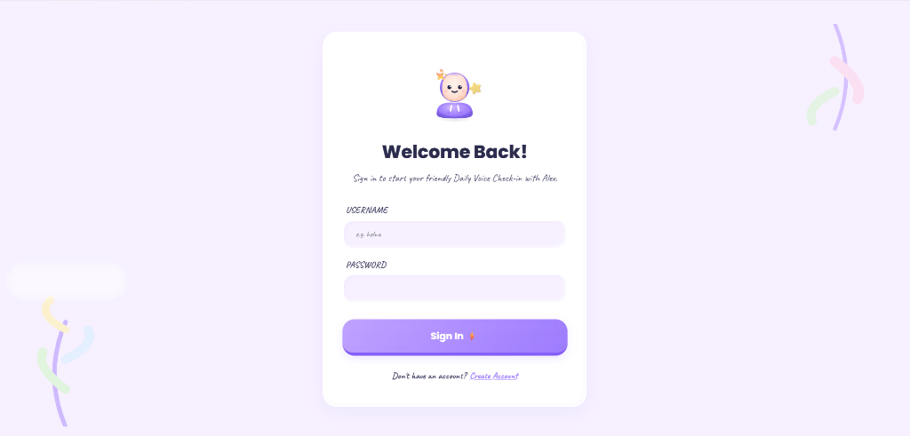
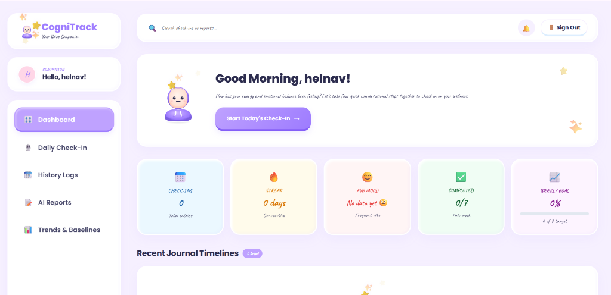
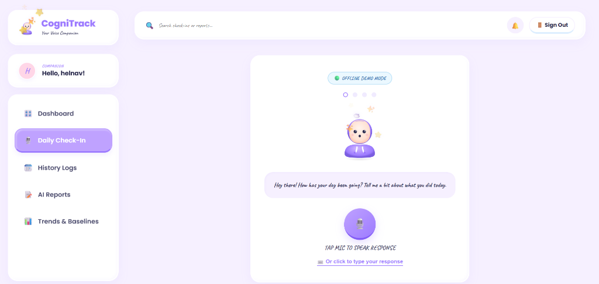

# CogniTrack 🧠

> **Live Demo**: 👉 **[helnavshaji.github.io/CogniTrack/](https://helnavshaji.github.io/CogniTrack/)** 👈

CogniTrack is an AI-powered cognitive health monitor and daily conversational companion. Designed as a friendly check-in assistant named **Alex**, the website conducts short, 4-question voice or text check-ins, extracts vocal and text biomarkers (speech pace, topic coherence, emotional valence, vocabulary richness), and generates a warm, personalized report filled with actionable advice, daily goals, and friendly validations.

---

## 📸 Screenshots

### 🔑 1. Welcome Screen
*Sign in to start your friendly mind check-in with Alex, featuring a clean claymorphic login interface.*


### 📊 2. Companion Dashboard
*Track your check-in counts, streaks, average mood baselines, and complete recent journal logs in a single interactive dashboard.*


### 🎙️ 3. Interactive Check-In
*Talk or type with Alex, featuring real-time visual companion mascot animations and an offline demo fallback badge.*


---

## 🌟 Key Features

*   **🎙️ Interactive Voice Check-in**: A conversational voice interface equipped with a responsive 2D SVG companion mascot that reacts and gestures based on whether it is listening, thinking, speaking, or comfort-hugging.
*   **⌨️ Typed Response Toggle**: Don't want to speak? Toggle typing mode to type your responses through a custom claymorphic input panel.
*   **🎨 Premium Framer Motion Animations**: Organic spring-based page transitions, sidebar navigation floats, staggered card entries, pulsing mic wave glows, and floating star overlays.
*   **📝 Best Friend Reports**: Generates a warm letter-style personal message at the end of each conversation containing:
    *   💬 *How you seemed today* (Warm summaries referencing your words)
    *   🌟 *What I noticed about you* (Positive reinforcement)
    *   🤝 *Real talk from your friend* (3 concrete, helpful pieces of advice)
    *   🎯 *Your one thing for tomorrow* (A tiny, specific micro-action)
    *   💙 *I'm proud of you* (Warm validation)
*   **📁 Sidebar History Logs**: Slides open to review all completed sessions, read-outs of dialogue logs, and past report cards.
*   **📊 Multivariate Trends**: Interactive Recharts-based line graph tracking speaking pace (Words Per Minute), semantic coherence %, and emotional valence across days.
*   **🚨 Cognitive Drift Detection**: Automatically monitors user biomarkers against their personal baseline over time to alert on noticeable changes (e.g. speaking slower, increased pauses, flatter vocal energy).
*   **🟢 Standalone Offline Fallback**: Fully functional client-side fallback mode that runs entirely in the browser when the backend is offline—featuring browser-level speech recognition, client-side letter generation, and `localStorage` persistence.

---

## 🛠️ Technology Stack

### Frontend (Client)
*   **Vite + React**: Core website skeleton.
*   **React Router**: Navigation routing with layout transitions.
*   **Recharts**: Visualizes multivariate biomarker charts.
*   **Framer Motion**: Delivers premium interactive spring animations and particle glows.
*   **Web Speech API**: Transcribes microphone voice input directly in the browser when offline.
*   **Axios**: Manages HTTP communications with the backend API.
*   **CSS Variable Design System**: Premium soft-claymorphic theme with glowing highlights.

### Backend (Server)
*   **FastAPI**: High-performance backend API.
*   **SQLAlchemy + SQLite**: Fast local database persistence.
*   **Groq API (Llama-3.3-70b)**: Orchestrates conversational dialogue responses and generates session report summaries.
*   **Numpy**: Computes cognitive drift scores and standard deviations for baseline metrics.

---

## 🚀 Getting Started

### Prerequisites
*   [Node.js](https://nodejs.org/) (v16+)
*   [Python](https://www.python.org/) (v3.9+)
*   Groq API Key (Set in `.env` file)

### Setup & Installation

1. **Clone the Repository**:
   ```bash
   git clone https://github.com/Helnavshaji/CogniTrack.git
   cd CogniTrack
   ```

2. **Configure Environment Variables**:
   Create a `.env` file in the project root:
   ```env
   GROQ_API_KEY=your_groq_api_key_here
   DATABASE_URL=sqlite:///./data/sessions.db
   ```

3. **Backend Setup**:
   ```bash
   # Create and activate python virtual environment
   python -m venv venv
   venv\Scripts\activate # On macOS/Linux: source venv/bin/activate
   
   # Install dependencies
   pip install -r requirements.txt
   
   # Start the FastAPI server
   python backend/main.py
   ```

4. **Frontend Setup**:
   ```bash
   cd frontend
   
   # Install node packages
   npm install
   
   # Run the Vite development server
   npm run dev
   ```
   Open **[http://localhost:5173](http://localhost:5173)** in your browser!

---

## 🔒 License
Distributed under the MIT License. See `LICENSE` for more information.
