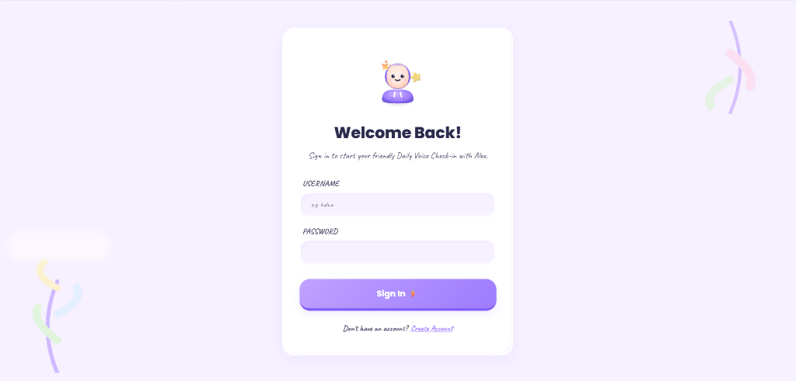
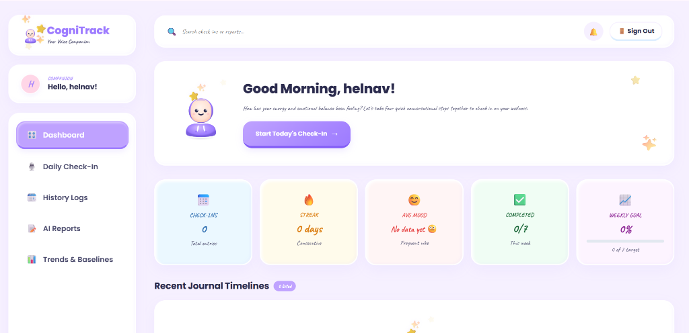
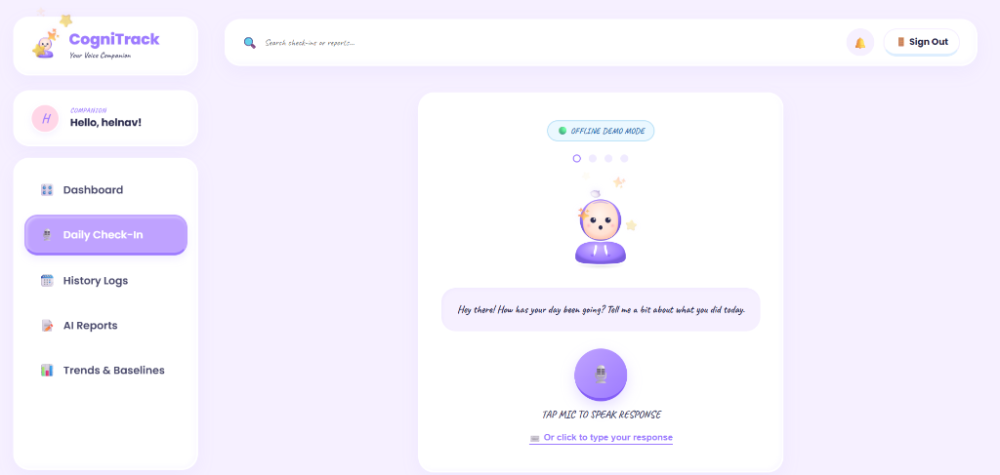

# CogniTrack

> **Live Demo**: **[helnavshaji.github.io/CogniTrack/](https://helnavshaji.github.io/CogniTrack/)**

CogniTrack is an AI-powered cognitive health monitor and daily conversational companion. Designed as a friendly check-in assistant named **Alex**, the application conducts short 4-question voice or text check-ins, extracts vocal and text biomarkers (speech pace, topic coherence, emotional valence, vocabulary richness), and generates a warm, personalized report filled with actionable advice, daily goals, and friendly validations.

---

## Screenshots

### 1. Welcome Screen
*Sign in to start your friendly mind check-in with Alex, featuring a clean claymorphic login interface.*


### 2. Companion Dashboard
*Track your check-in counts, streaks, average mood baselines, and complete recent journal logs in a single interactive dashboard.*


### 3. Interactive Check-In
*Talk or type with Alex, featuring real-time visual companion mascot animations and an offline demo fallback badge.*


---

## Key Features

*   **Interactive Voice Check-in**: A conversational voice interface equipped with a responsive 2D SVG companion mascot that reacts and gestures based on whether it is listening, thinking, speaking, or comfort-hugging.
*   **Typed Response Toggle**: Don't want to speak? Toggle typing mode to type your responses through a custom claymorphic input panel.
*   **Premium Framer Motion Animations**: Organic spring-based page transitions, sidebar navigation floats, staggered card entries, pulsing mic wave glows, and floating star overlays.
*   **Best Friend Reports**: Generates a warm letter-style personal message at the end of each conversation containing:
    *   *How you seemed today* (Warm summaries referencing your words)
    *   *What I noticed about you* (Positive reinforcement)
    *   *Real talk from your friend* (3 concrete, helpful pieces of advice)
    *   *Your one thing for tomorrow* (A tiny, specific micro-action)
    *   *I'm proud of you* (Warm validation)
*   **Sidebar History Logs**: Slides open to review all completed sessions, read-outs of dialogue logs, and past report cards.
*   **Multivariate Trends**: Interactive Recharts-based line graph tracking speaking pace (Words Per Minute), semantic coherence %, and emotional valence across days.
*   **Cognitive Drift Detection**: Automatically monitors user biomarkers against their personal baseline over time to alert on noticeable changes (e.g. speaking slower, increased pauses, flatter vocal energy).
*   **Standalone Offline Fallback**: Fully functional client-side fallback mode that runs entirely in the browser when the backend is offline—featuring browser-level speech recognition, client-side letter generation, and localStorage persistence.

---

## Technology Stack

### Frontend (Client)
*   **Vite + React**: Core user interface framework.
*   **React Router**: Page routing and navigation.
*   **Recharts**: Visualizes multivariate cognitive biomarker charts.
*   **Framer Motion**: Provides fluid UI transitions and interactive animations.
*   **Web Speech API**: Handles client-side speech recognition in offline demo mode.
*   **Axios**: Manages API communication with the backend server.
*   **CSS Variable Design System**: Soft-claymorphic theme with customizable design tokens.

### Backend (Server)
*   **FastAPI**: High-performance asynchronous Python web framework.
*   **SQLAlchemy**: Database ORM supporting PostgreSQL (cloud deployment) and SQLite (local development).
*   **Groq API**:
    *   `llama-3.3-70b-versatile` for real-time conversational responses and personal report generation.
    *   `whisper-large-v3-turbo` for cloud-based audio transcription with word-level timestamps.
*   **Numpy & Spacy**: Extracts linguistic biomarkers and calculates cognitive drift metrics.

---

## Deployment Configuration

### Cloud Hosting Setup

1.  **Backend (Render)**:
    *   **Root Directory**: `backend`
    *   **Build Command**: `pip install -r requirements.txt && python -m spacy download en_core_web_sm`
    *   **Start Command**: `uvicorn main:app --host 0.0.0.0 --port $PORT`
    *   **Environment Variables**:
        *   `GROQ_API_KEY`: Your Groq API key.
        *   `DATABASE_URL`: PostgreSQL connection string (e.g. from Supabase or Neon). If omitted, defaults to local SQLite.
        *   `ALLOWED_ORIGINS`: Set to your deployed Vercel frontend URL or `*`.

2.  **Frontend (Vercel)**:
    *   **Root Directory**: `frontend`
    *   **Build Command**: `npm run build`
    *   **Environment Variables**:
        *   `VITE_API_URL`: URL of your deployed Render backend (e.g. `https://cognitrack-backend.onrender.com`).

---

## Local Development & Setup

### Prerequisites
*   Node.js (v16+)
*   Python (v3.9+)
*   Groq API Key

### Setup Instructions

1. **Clone the Repository**:
   ```bash
   git clone https://github.com/Helnavshaji/CogniTrack.git
   cd CogniTrack
   ```

2. **Backend Setup**:
   ```bash
   cd backend
   python -m venv venv
   
   # Windows
   venv\Scripts\activate
   # macOS / Linux
   # source venv/bin/activate

   pip install -r requirements.txt
   python -m spacy download en_core_web_sm
   ```

   Create a `.env` file in the `backend` directory:
   ```env
   GROQ_API_KEY=your_groq_api_key_here
   DATABASE_URL=sqlite:///./data/sessions.db
   ALLOWED_ORIGINS=*
   ```

   Run the backend server:
   ```bash
   python main.py
   ```

3. **Frontend Setup**:
   ```bash
   cd ../frontend
   npm install
   ```

   Create a `.env` file in the `frontend` directory:
   ```env
   VITE_API_URL=http://localhost:8000
   ```

   Run the development server:
   ```bash
   npm run dev
   ```
   Open **http://localhost:5173** in your browser.

---

## License
Distributed under the MIT License. See `LICENSE` for more information.
